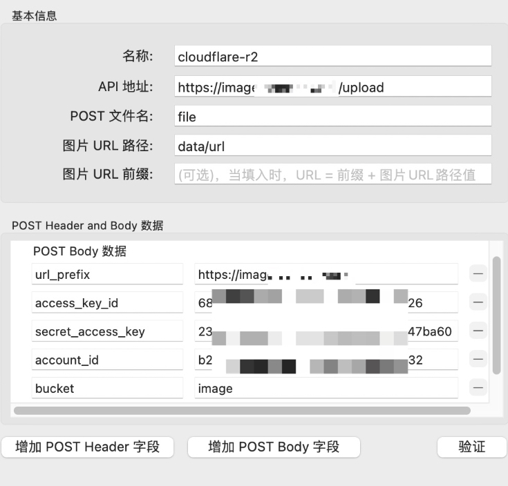

# Usage
## Run Server
uvicorn uploader:app

## Nginx Config (Optional)
```
server {
    location /upload {
        proxy_pass         http://127.0.0.1:8000;
        proxy_set_header Host $host;
    }
}
```

## Upload Image
args:
- account_id: required
- access_key_id: required
- secret_access_key: required
- bucket: required
- file: required
- key_pattern: optional
- url_prefix: optional

## MWeb Config

